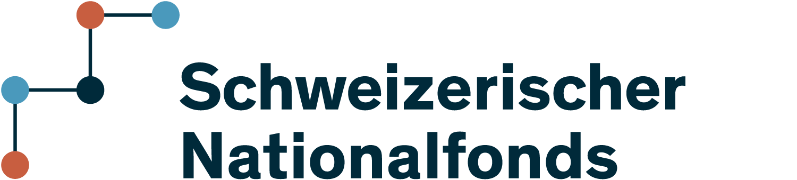

.. raw:: html

    

        
    

**MNE-RT** is an open-source Python library for
**real-time M/EEG signal processing and analysis**, built on
`MNE-Python <https://mne.tools>`_ and
`MNE-LSL <https://mne.tools/mne-lsl>`_.
It covers the full real-time pipeline — from amplifier to 3-D brain display, 
in a single, researcher-friendly API designed for neurofeedback, BCI,
and clinical or basic-science monitoring applications.

.. raw:: html

    

Key capabilities
----------------

.. list-table::
   :widths: 1 45
   :header-rows: 0

   * - ✔
     - **Multiple real-time feature modalities** — sensor power, ERD/ERS, Hjorth parameters,
       spectral centroid and peak, band ratio, cross-frequency coupling (CFC),
       connectivity, instantaneous phase (Hilbert analytic signal),
       graph-theory metrics, and more.
       See :doc:`modalities` for the full list.

   * - ✔
     - **Sensor and source-space** processing using
       `MNE <https://mne.tools>`_ inverse operators (eLORETA, MNE, dSPM).
       Compute and stream cortical-source activity.

   * - ✔
     - **Live artifact correction** —
       :class:`~mne_rt.tools.ORICA` (online ICA),
       :class:`~mne_rt.tools.AdaptiveLMSFilter` (adaptive least-mean-squares),
       :class:`~mne_rt.tools.GEDAIDenoiser` (generalised eigendecomposition),
       :class:`~mne_rt.tools.ASRDenoiser` (artifact subspace reconstruction), and
       :class:`~mne_rt.tools.RTMaxwellFilter` (real-time Maxwell/SSS filtering for MEG).
       See :doc:`denoising` for algorithm details and benchmarks.

   * - ✔
     - **Real-time quality control** — :class:`~mne_rt.tools.BadChannelDetector`
       flags flat, noisy, or de-correlated channels every window using a
       robust rolling-vote mechanism.  :class:`~mne_rt.tools.RiemannianPotatoDetector`
       detects artifactual epochs by measuring Riemannian distance from a
       clean-data geometric mean on the SPD manifold.

   * - ✔
     - **Adaptive feedback protocols** — :class:`~mne_rt.protocols.ThresholdProtocol`,
       :class:`~mne_rt.protocols.ZScoreProtocol`,
       :class:`~mne_rt.protocols.PercentileProtocol`,
       :class:`~mne_rt.protocols.LinearTrendProtocol`
       (OLS-based trend reward — encourages sustained directional change rather
       than single-window threshold crossings),
       :class:`~mne_rt.protocols.ShamProtocol`
       (double-blind sham wrapper for within-session RCTs),
       :class:`~mne_rt.protocols.UpDownStaircaseProtocol`
       (adaptive psychophysics staircase converging to a target success rate),
       :class:`~mne_rt.protocols.MultiBandProtocol`
       (simultaneous two-band reward — e.g., alpha↑ + theta↓),
       :class:`~mne_rt.protocols.RLProtocol`
       (ε-greedy reinforcement-learning threshold search — fully self-calibrating),
       :class:`~mne_rt.protocols.OperantProtocol`
       (partial reinforcement schedules: FR, VR, FI, VI — wraps any inner protocol), and
       :class:`~mne_rt.protocols.TransferProtocol`
       (cross-session z-score seeded from a prior session file — zero warmup)
       give fine-grained control over when to issue a reward.
       See :doc:`protocols` for formulas, selection guide, and examples.

   * - ✔
     - **Feature combiners** — blend N parallel feature values into a single feedback score.
       :class:`~mne_rt.combiners.WeightedSumCombiner` (normalised weighted sum),
       :class:`~mne_rt.combiners.GeometricMeanCombiner` (weighted geometric mean — best for
       multiplicative power features), :class:`~mne_rt.combiners.ZScoredNormCombiner`
       (unit-free deviation-from-baseline Euclidean norm), and
       :class:`~mne_rt.combiners.LearnedCombiner` (any fitted ``sklearn``-compatible
       estimator).  See :doc:`tutorial` for usage examples.

   * - ✔
     - **Nine real-time visualisation windows** — a scrolling NF
       :class:`~mne_rt.viz.NFPlot`, a scrolling raw :class:`~mne_rt.viz.RawPlot`
       (with bad-channel marking and bad-segment annotation),
       a continuous :class:`~mne_rt.viz.EpochPlot` with trigger/epoch overlays,
       a live scalp :class:`~mne_rt.viz.TopomapPlot`,
       an interactive :class:`~mne_rt.viz.BrainPlot` (3-D cortical surface),
       a scalp-layout :class:`~mne_rt.viz.TopoPlot` ERP display with ±SEM shading and
       re-referencing, an all-channel :class:`~mne_rt.viz.ButterflyPlot` with
       region-colour coding, a per-channel :class:`~mne_rt.viz.CompareEvoked`
       with peak markers, and a Morlet-wavelet :class:`~mne_rt.viz.TFRPlot`
       (time-frequency heatmaps, induced or evoked mode).  All plots
       update live and support EEG and MEG data.

   * - ✔
     - **Dual feedback output** — broadcast values via OSC (Max/MSP,
       SuperCollider, TouchDesigner) with :class:`~mne_rt.osc.OSCSender`, or over
       `LSL <https://labstreaminglayer.org>`_ with :class:`~mne_rt.lsl_output.LSLSender`
       for low-latency same-machine integration with PsychoPy, OpenViBE, BCI2000,
       and other LSL-aware apps.

   * - ✔
     - **CLI** — launch full real-time M/EEG sessions with a single
       ``mne-rt run`` command, driven by a YAML config file. See :doc:`cli`.

   * - ✔
     - **Real-time decoding** — :class:`~mne_rt.RTDecode` wraps an
       :mod:`mne.decoding` (CSP, or Scaler + Vectorizer) and scikit-learn
       classifier pipeline, fit offline on labelled calibration epochs and
       queried once per acquisition window as the ``"decode"`` NF modality.
       See :doc:`decoding`.

.. toctree::
   :hidden:
   :caption: Getting started

   install
   tutorial

.. toctree::
   :hidden:
   :caption: Reference

   api
   visualization
   cli
   denoising
   modalities
   decoding
   protocols
   whats_new

.. toctree::
   :hidden:
   :caption: Examples

   auto_examples/index

.. raw:: html

    

Quick install
-------------

.. tabs::

   .. tab:: pip

      .. code-block:: bash

          pip install mne-rt                 # core  (MNE, LSL, OSC included)
          pip install "mne-rt[full]"         # + 3-D viz, dev tools, docs

   .. tab:: uv

      .. code-block:: bash

          # Install uv once
          curl -LsSf https://astral.sh/uv/install.sh | sh

          uv pip install mne-rt
          uv pip install "mne-rt[full]"      # + 3-D viz, dev tools, docs

          # Editable install from source
          git clone https://github.com/payamsash/mne-rt.git
          cd mne-rt && uv pip install -e ".[dev]"

   .. tab:: conda / mamba

      .. code-block:: bash

          mamba install -c conda-forge mne-rt

See :doc:`install` for full instructions.

Quick start
-----------

.. code-block:: python

    from mne_rt import RTStream

    nf = RTStream(
        "sub01",
        session="01",
        subjects_dir="/data/subjects",
        montage="easycap-M1",
    )
    nf.connect_to_lsl(mock_lsl=True)          # or connect to a real amplifier
    nf.record_main(
        duration=300,
        modality=["sensor_power", "erd_ers"],
        show_nf_signal=True,
    )

Pipeline overview
-----------------

.. raw:: html

   

   <table style="border-collapse:separate; border-spacing:0; width:100%; font-family:-apple-system,BlinkMacSystemFont,'Segoe UI',sans-serif; font-size:13px;">
   <thead>
     <tr>
       <th style="background:#1e40af;color:white;padding:8px 14px;border-radius:8px 0 0 0;white-space:nowrap;">Stage</th>
       <th style="background:#1e40af;color:white;padding:8px 14px;">Class / Function</th>
       <th style="background:#1e40af;color:white;padding:8px 14px;border-radius:0 8px 0 0;">Notes</th>
     </tr>
   </thead>
   <tbody>
     <tr style="background:#eff6ff;">
       <td style="padding:7px 14px;border-bottom:1px solid #dbeafe;font-weight:600;white-space:nowrap;">① Acquisition</td>
       <td style="padding:7px 14px;border-bottom:1px solid #dbeafe;"><code>RTStream.connect_to_lsl()</code></td>
       <td style="padding:7px 14px;border-bottom:1px solid #dbeafe;">Hardware amplifier or mock replay via mne-lsl <code>StreamInlet</code></td>
     </tr>
     <tr style="background:#f0fdf4;">
       <td style="padding:7px 14px;border-bottom:1px solid #dcfce7;font-weight:600;white-space:nowrap;">② Baseline</td>
       <td style="padding:7px 14px;border-bottom:1px solid #dcfce7;"><code>RTStream.record_baseline()</code></td>
       <td style="padding:7px 14px;border-bottom:1px solid #dcfce7;">Bad-channel detection · ICA · noise covariance (the head model is built on first use)</td>
     </tr>
     <tr style="background:#eff6ff;">
       <td style="padding:7px 14px;border-bottom:1px solid #dbeafe;font-weight:600;white-space:nowrap;">③ Quality control</td>
       <td style="padding:7px 14px;border-bottom:1px solid #dbeafe;"><code>BadChannelDetector</code> · <code>RiemannianPotatoDetector</code></td>
       <td style="padding:7px 14px;border-bottom:1px solid #dbeafe;">Flags flat / noisy channels and artifactual covariance windows every epoch</td>
     </tr>
     <tr style="background:#fffbeb;">
       <td style="padding:7px 14px;border-bottom:1px solid #fef3c7;font-weight:600;white-space:nowrap;">④ Artifact correction</td>
       <td style="padding:7px 14px;border-bottom:1px solid #fef3c7;"><code>ORICA</code> · <code>AdaptiveLMS</code> · <code>GEDAIDenoiser</code> · <code>ASRDenoiser</code> · <code>RTMaxwellFilter</code></td>
       <td style="padding:7px 14px;border-bottom:1px solid #fef3c7;">One or more methods selected per session; all operate sample-by-sample</td>
     </tr>
     <tr style="background:#f5f3ff;">
       <td style="padding:7px 14px;border-bottom:1px solid #ede9fe;font-weight:600;white-space:nowrap;">⑤ Feature extraction</td>
       <td style="padding:7px 14px;border-bottom:1px solid #ede9fe;"><code>record_main(modality=[…])</code></td>
       <td style="padding:7px 14px;border-bottom:1px solid #ede9fe;">20 feature modalities in sensor or source space; parallel thread-pool per window</td>
     </tr>
     <tr style="background:#ecfdf5;">
       <td style="padding:7px 14px;border-bottom:1px solid #d1fae5;font-weight:600;white-space:nowrap;">⑥ Feedback protocol</td>
       <td style="padding:7px 14px;border-bottom:1px solid #d1fae5;"><code>ThresholdProtocol</code> · <code>ZScoreProtocol</code> · <code>PercentileProtocol</code> · <code>LinearTrendProtocol</code> · <code>ShamProtocol</code> · <code>UpDownStaircaseProtocol</code> · <code>MultiBandProtocol</code> · <code>RLProtocol</code> · <code>OperantProtocol</code> · <code>TransferProtocol</code></td>
       <td style="padding:7px 14px;border-bottom:1px solid #d1fae5;">Maps feature value → output signal; all are stateful and adaptive</td>
     </tr>
     <tr style="background:#eff6ff;">
       <td style="padding:7px 14px;border-bottom:1px solid #dbeafe;font-weight:600;white-space:nowrap;">⑦ Visualisation</td>
       <td style="padding:7px 14px;border-bottom:1px solid #dbeafe;"><code>NFPlot</code> · <code>RawPlot</code> · <code>EpochPlot</code> · <code>TopomapPlot</code> · <code>BrainPlot</code> · <code>TopoPlot</code> · <code>ButterflyPlot</code> · <code>CompareEvoked</code> · <code>TFRPlot</code></td>
       <td style="padding:7px 14px;border-bottom:1px solid #dbeafe;">Scrolling signal · epoch overlays · scalp topo · 3-D brain · scalp-layout ERP · butterfly overlay · per-channel comparison · TFR heatmaps</td>
     </tr>
     <tr style="background:#f0fdf4;">
       <td style="padding:7px 14px;font-weight:600;white-space:nowrap;">⑧ Feedback output</td>
       <td style="padding:7px 14px;"><code>OSCSender</code> · <code>LSLSender</code></td>
       <td style="padding:7px 14px;">UDP/OSC to Max·MSP, SuperCollider, PD · LSL for PsychoPy, OpenViBE, BCI2000</td>
     </tr>
   </tbody>
   </table>
   

Cite
----

If you use MNE-RT, please cite :footcite:`shabestari2025advances`.

.. footbibliography::

.. tabs::

    .. tab:: APA

        .. code-block:: none

            Shabestari, P. S., Ribes, D., Défayes, L., Cai, D., Groves, E.,
            Behjat, H. H., … & Neff, P. (2025). Advances on Real Time M/EEG
            Neural Feature Extraction. IEEE CBMS 2025.

    .. tab:: BibTeX

        .. code-block:: bibtex

            @inproceedings{shabestari2025advances,
                title   = {Advances on Real Time M/EEG Neural Feature Extraction},
                author  = {Shabestari, Payam S and others},
                booktitle = {2025 IEEE 38th CBMS},
                pages   = {337--338},
                year    = {2025},
                organization = {IEEE}
            }

.. raw:: html

    

Development was supported by the
`Swiss National Science Foundation <https://www.snf.ch/en>`_ (grant number — 208164).
